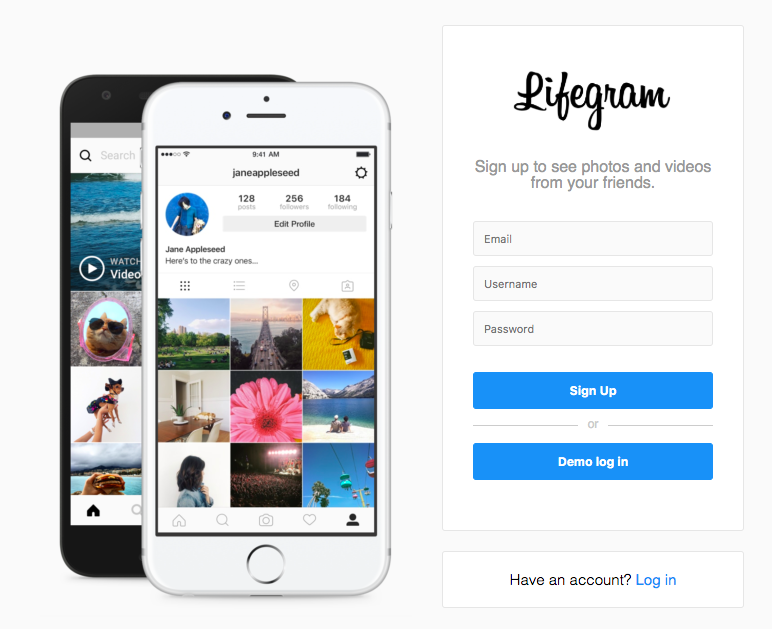
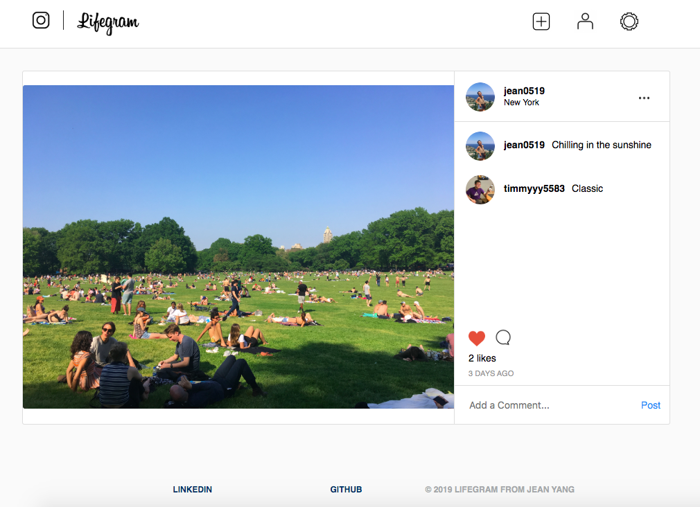

# Lifegram

<a href="https://lifegram.herokuapp.com/#/">Live Demo</a>

<p align="center">
  


<h4 align="center" >
  Lifegram is a social media platform inspired by Instagram for people who enjoy sharing their life snippets.
</h4>


 


<br/><br/>
<br/><br/>
<br/><br/>

## Technologies
* Ruby 
* JavaScript
* Rails 
* React.js
* Redux
* PostGreSQL
* AWS S3

## Features 
* User authentication
* Posts
* Likes
* Comments


## Code Highlights
* Render Function 

  I built a `renderEdit` function to make sure that only the current user can edit the profile page. To this end, this function will only show the edit profile button when if the user id is the same as current user id.

```JavaScript
// frontend/users/user_profile.jsx

renderEdit() {
        
        if (this.props.user.id === this.props.currentUser.id) {
            return (
                <div className="edit-profile-button">
                    <Link to={`/users/${this.props.user.id}/edit`} className="edit-link">Edit Profile</Link>
                </div>
            )
        } else {
            return null
        }
    }
```

* Custom Modal

  I implemented a custom modal component to dynamically render various modals throughout the website. Modals are used to show the different options to upload photos, to logout users, to update user profiles, to go to the post show page, and go back to the index page.

```JavaScript
// frontend/components/modal.jsx

function Modal({ modal, closeModal }) {
    if (!modal) {
        return null;
    }
    let component;
    switch (modal) {
        case 'upload':
            component = <PostUploadContainer />;
            break;
        case 'update':
            component = <UpdateProfilePhotoContainer />;
            break;
        case 'logoutOption':
            component = <LogoutOptionContainer />;
            break;
        case 'postOption':
            component = <PostOptionContainer/>
            break;
        case 'showOption':
            component = <ShowOptionContainer />
            break;
        default:
            return null;
    }
    return (
        <div className="modal-background" onClick={closeModal}>
            <div className="modal-child" onClick={e => e.stopPropagation()}>
                {component}
            </div>
        </div>
    );
}

const msp = state => {
    
    return {
        modal: state.modal,
        postId: state.ui.currentPostId
    };
};

const mdp = dispatch => {
    return {
        closeModal: () => dispatch(closeModal())
    };
};
```
